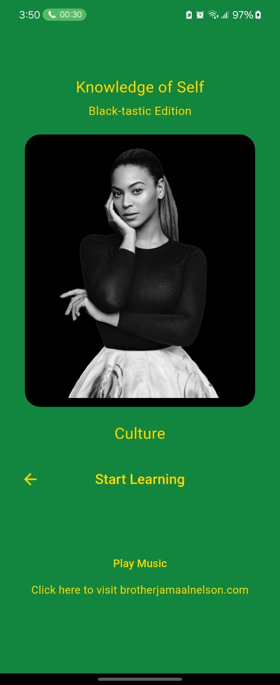
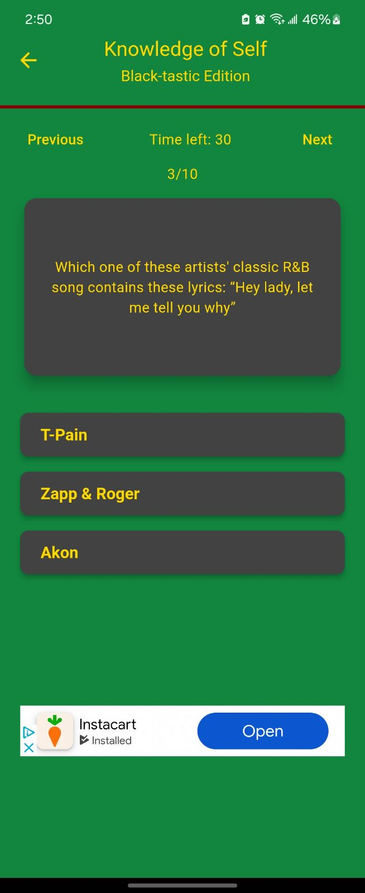
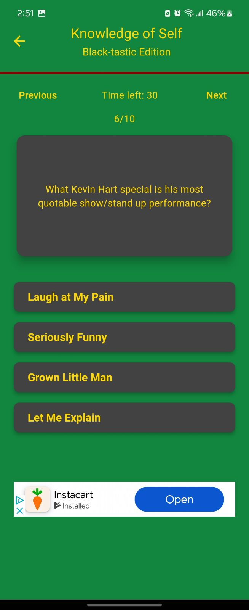
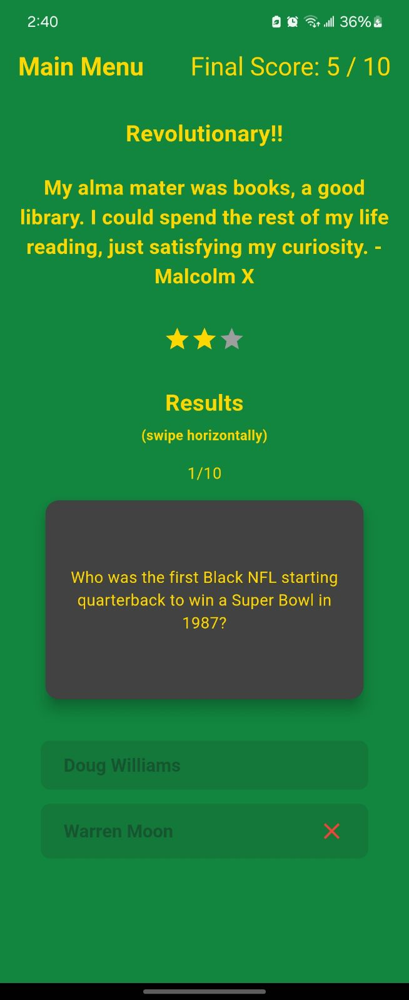

  
    

# Welcome to Knowledge of Self Trivia!    

  <table style="border-collapse: collapse; border: none;">
    <tr>
      <td style="border: none; padding-right: 10px;">
        
      </td>
      <td style="border: none;">
        
      </td>
    </tr>
  </table>

### Laugh and learn as you venture through Black history and culture ranging from Black music, scholars, sayings/doings, movies, activists, inventors, and more!

  
  

   
  

  
  

# How to download

 - Find and click the `GET IT ON GITHUB` button at the top of this page
 - Under `ASSETS`, find and download `kos_1.1.5.apk` to your Android device
 - Once downloaded, go to your `Downloads Folder` and find `kos_1.1.5.apk` and click to install
   - Note: you may have to change security permissions to install apps from sources other than Google Play Store
   - Here is more infomation: https://www.howtogeek.com/313433/how-to-sideload-apps-on-android/
